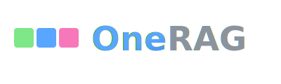

<p align="center">
  
</p>

<p align="center">
  <strong>5분 안에 시작하고, 블록처럼 조립하는 RAG 시스템</strong>
</p>

**한국어** | [English](README_EN.md)

[](https://github.com/youngouk/OneRAG/actions/workflows/ci.yml)
[](https://opensource.org/licenses/MIT)
[](https://www.python.org/downloads/)

## 왜 OneRAG인가?

| 기존 방식 | OneRAG |
|----------|--------------|
| 특정 벡터 DB에 종속 | **6종 벡터 DB** 중 선택 (설정 1줄) |
| 특정 LLM에 종속 | **4종 LLM** 중 선택 (설정 1줄) |
| 기능 추가 시 코드 수정 | **YAML 설정**으로 On/Off |
| 처음부터 전체 구축 | **필요한 것만** 조립 |

---

## 5분 Quickstart

```bash
# 1. 클론 및 설치
git clone https://github.com/youngouk/OneRAG.git
cd OneRAG && uv sync

# 2. 환경 설정 (API 키 하나만)
cp quickstart/.env.quickstart .env
# .env에서 GOOGLE_API_KEY 설정 (무료: https://aistudio.google.com/apikey)

# 3. 실행
make quickstart
```

**끝!** http://localhost:8000/docs 에서 바로 테스트

```bash
# 종료
make quickstart-down
```

---

## 블록처럼 조립하기

### 벡터 DB 바꾸기 (설정 1줄)

```bash
# .env 파일에서 한 줄만 변경
VECTOR_DB_PROVIDER=weaviate  # 또는 chroma, pinecone, qdrant, pgvector, mongodb
```

### LLM 바꾸기 (설정 1줄)

```bash
# .env 파일에서 한 줄만 변경
LLM_PROVIDER=google  # 또는 openai, anthropic, openrouter
```

### 리랭커 바꾸기 (YAML 2줄)

```yaml
# app/config/features/reranking.yaml
reranking:
  approach: "cross-encoder"  # 또는 late-interaction, llm, local
  provider: "jina"           # 또는 cohere, google, openai, openrouter, sentence-transformers
```

### 기능 On/Off (YAML 설정)

```yaml
# 캐싱 활성화
cache:
  enabled: true
  type: "redis"  # 또는 memory, semantic

# GraphRAG 활성화
graph_rag:
  enabled: true

# PII 마스킹 활성화
pii:
  enabled: true
```

---

## 조립 가능한 블록들

| 카테고리 | 선택지 | 변경 방법 |
|---------|--------|----------|
| **벡터 DB** | Weaviate, Chroma, Pinecone, Qdrant, pgvector, MongoDB | 환경변수 1줄 |
| **LLM** | Google Gemini, OpenAI, Anthropic Claude, OpenRouter | 환경변수 1줄 |
| **리랭커** | Jina, Cohere, Google, OpenAI, OpenRouter, Local | YAML 2줄 |
| **캐시** | Memory, Redis, Semantic | YAML 1줄 |
| **쿼리 라우팅** | LLM 기반, Rule 기반 | YAML 1줄 |
| **한국어 검색** | 동의어, 불용어, 사용자사전 | YAML 설정 |
| **보안** | PII 탐지, 마스킹, 감사 로깅 | YAML 설정 |
| **GraphRAG** | 지식 그래프 기반 관계 추론 | YAML 1줄 |
| **Agent** | 도구 실행, MCP 프로토콜 | YAML 설정 |

---

## 단계별 구성 가이드

| 단계 | 구성 | 용도 |
|------|------|------|
| **Basic** | 벡터 검색 + LLM | 간단한 문서 Q&A |
| **Standard** | + 하이브리드 검색 + Reranker | 검색 품질이 중요한 서비스 **(권장)** |
| **Advanced** | + GraphRAG + Agent | 복잡한 관계 추론, 도구 실행 |

Basic으로 시작해서, 필요할 때 블록을 추가하면 됩니다.

---

## RAG 파이프라인

```
Query → Router → Expansion → Retriever → Cache → Reranker → Generator → PII Masking → Response
```

| 단계 | 기능 | 교체 가능 |
|------|------|----------|
| 쿼리 라우팅 | 쿼리 유형 분류 | LLM/Rule 선택 |
| 쿼리 확장 | 동의어, 불용어 처리 | 사전 커스텀 |
| 검색 | 벡터/하이브리드 검색 | 6종 DB |
| 캐싱 | 응답 캐시 | 3종 캐시 |
| 재정렬 | 검색 결과 정렬 | 6종 리랭커 |
| 답변 생성 | LLM 응답 생성 | 4종 LLM |
| 후처리 | 개인정보 마스킹 | 정책 커스텀 |

---

## 개발

```bash
make dev-reload    # 개발 서버 (자동 리로드)
make test          # 테스트 실행
make lint          # 린트 검사
make type-check    # 타입 체크
```

## 문서

- [상세 설정 가이드](docs/SETUP.md)
- [아키텍처 설명](docs/TECHNICAL_DEBT_ANALYSIS.md)
- [Streaming API 가이드](docs/streaming-api-guide.md)
- [WebSocket API 가이드](docs/websocket-api-guide.md)

## 라이선스

MIT License

---

> 이 프로젝트는 RAG Chat Service PM이 여러 프로젝트를 진행하며 구현해보고 싶었던 기능들을 모아 만들었습니다.
> RAG를 처음 접하는 분들이 쉽게 PoC를 진행하고, 프로덕션까지 확장할 수 있도록 설계했습니다.
